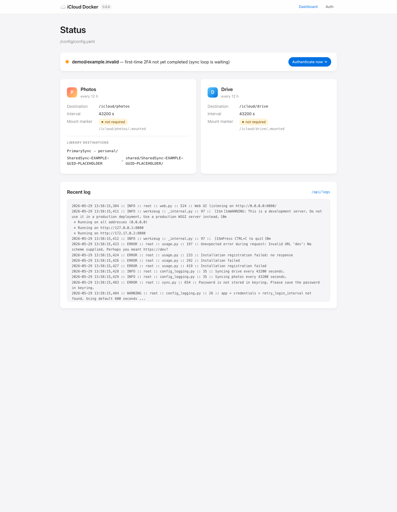

# icloud-docker-plus

A drop-in `mandarons/icloud-docker` image with iOS 26.4 auth working, Live Photo `.mov` pairs landing on disk, per-library destinations, an opt-in web UI for re-authentication from your phone, and nine other improvements I needed for my own ~70 000-photo iCloud library running on a Synology NAS.

```bash
docker pull ghcr.io/epheterson/icloud-docker-plus:latest
```

Same Dockerfile, same entrypoint, same config schema as upstream. Every new feature is opt-in with a safe default. When the PRs land upstream, switch back — your config and on-disk files keep working.

## Why this exists

I wanted iCloud Shared Photo Library + iCloud Drive backed up to my NAS without standing up yet another auth flow per library. Two `boredazfcuk/docker-icloudpd` containers (one per library, each with its own 2FA setup, no Drive at all) wasn't it. `mandarons/icloud-docker` was the right shape — one auth, all libraries, Drive included — so I migrated, hit a string of papercuts (iOS 26.4 broke auth entirely, Live Photos dropped the `.mov`, Personal and Shared dumped into the same tree, …), and fixed them. Putting the result here in case someone else is looking for the same thing.

## What's new vs upstream

| | upstream | here |
|---|---|---|
| iOS 26.4+ trusted-device 2FA | broken ([#426](https://github.com/mandarons/icloud-docker/issues/426), open since Apr 2026) | works |
| Live Photo `.mov` pair | dropped ([#199](https://github.com/mandarons/icloud-docker/issues/199), open since Mar 2024) | downloads alongside the HEIC |
| Per-library subdirs (Personal vs Shared) | one shared tree | `photos.library_destinations` |
| Migrate from boredazfcuk without re-download | not possible | `filename_format: simple` + size-based dedup |
| `--dry-run` pre-flight | none | authenticate + summarize, no writes |
| Bind-mount failsafe | none | opt-in `.mounted` marker (every library subdir, not just root) |
| Web UI for on-device re-auth | `EXPOSE 80` in the Dockerfile, no server bound to it | opt-in Flask app on `:8080` |
| Keyring across `compose recreate` | wiped, full re-auth every time | persists in `/config` |
| Photos sync memory on 100k+ libraries | kernel-OOMs at 4 GB | bounded at ~280 MB |

Plus three smaller fixes: iWork/JMG package downloads no longer count as failures; zip bundles with bare-rooted entries don't clobber siblings; test suite passes on macOS dev hosts.

## Quick start

`docker-compose.yml`:

```yaml
services:
  icloud:
    image: ghcr.io/epheterson/icloud-docker-plus:latest
    container_name: icloud
    restart: unless-stopped
    environment:
      - TZ=America/Los_Angeles
      - ENV_CONFIG_FILE_PATH=/config/config.yaml
    volumes:
      - ./config:/config
      - /path/to/photos:/icloud/photos
      - /path/to/drive:/icloud/drive
    mem_limit: 1g     # ample for most libraries since PR 12 (streaming enum)
```

Minimal `config/config.yaml`:

```yaml
app:
  credentials:
    username: you@apple.example
  root: /icloud
  region: global
  logger: { level: info, filename: /config/icloud.log }

photos: { destination: photos, sync_interval: 43200 }
drive:  { destination: drive,  sync_interval: 43200 }
```

Then:

```bash
docker compose up -d
docker exec -it icloud sh -c "icloud --username=you@apple.example --session-directory=/config/session_data"
# enter password + 6-digit 2FA code from your trusted device
docker logs -f icloud
```

## Migration

**From upstream `mandarons/icloud-docker`** — swap the image, that's it:

```diff
- image: mandarons/icloud-drive:latest
+ image: ghcr.io/epheterson/icloud-docker-plus:latest
```

**From `boredazfcuk/docker-icloudpd`** without re-downloading anything:

1. Stop your existing boredazfcuk container(s) — leave them stopped, don't `rm` (easy rollback).
2. Mount the parent of your existing per-library dirs at `/icloud/photos`.
3. In `config.yaml`, set `filename_format: simple` (matches boredazfcuk's plain `IMG_1234.HEIC`) and `library_destinations` mapping each iCloud library to your existing subdir name:

   ```yaml
   photos:
     filename_format: simple
     library_destinations:
       PrimarySync: Personal      # ← your existing Personal dir name
       SharedLibrary: Shared      # ← your existing Shared dir name
   ```

4. Before letting the sync loop touch anything, run the pre-flight:

   ```bash
   docker exec -it icloud python /app/src/main.py --dry-run --check-files 200
   ```

   It walks 200 photos per library + 200 Drive files, reports per-service `would_skip` / `size_mismatch` / `not_found` counts. If `would_skip` dominates, the dedup-by-size will recognize your existing files and nothing re-downloads. If `not_found` dominates, your paths don't line up — fix before letting the real sync run.

5. `docker compose up -d` and watch the logs. Existing files log `No changes detected. Skipping`; only genuine new items download.

## New config knobs

All under `photos:` unless noted. All optional, all default-OFF.

- `library_destinations: {PrimarySync: personal, SharedLibrary: shared}` — each iCloud library gets its own subdir of `photos.destination`. The `SharedLibrary` alias matches Apple's GUID-named shared zones (`SharedSync-…`) so you don't have to hardcode your GUID.
- `filename_format: simple` — plain `IMG_1234.HEIC` instead of `IMG_1234__original__<base64id>.HEIC`. Collision-safe (falls back to the suffix form when two photos share a name). **Pick at install time — can't change after files exist.**
- `preserve_originals_as_bak: true` — when both `original` and `original_alt` are in `file_sizes`, edited photos write the unmodified version as `.HEIC.original.bak` so it stays out of Plex / Photos.app / Synology Photos.
- `require_mount_marker: true` — refuse to sync unless a `.mounted` file exists in every destination. With `library_destinations` the marker is required in each subdir too — the whole point of per-library subdirs is usually separate bind mounts, and any one of them could be the failed mount.
- `app.web_ui.enabled: true` — opt-in Flask app on `:8080` for dashboard + on-device 2FA re-auth.

Live Photo `.mov` pair downloads automatically when `original` is in `file_sizes` (no config needed). Naming follows whichever `filename_format` you chose.

## Web UI

<table>
<tr>
<td width="60%"></td>
<td width="40%"></td>
</tr>
</table>

Opt-in via `app.web_ui.enabled: true`. Dashboard shows current Apple ID, per-service mount-marker status, sync intervals, last 200 log lines. `/auth` does the full re-authentication flow from your phone. **No built-in login** — put it behind Cloudflare Tunnel + Authelia, Tailscale, or your own auth proxy. Don't expose it bare to the public internet.

## Open PRs

The 13 PRs feeding this image, in dependency order:

**To `mandarons/icloudpy`** — RFC: [icloudpy#137](https://github.com/mandarons/icloudpy/issues/137)
1. [icloudpy#138](https://github.com/mandarons/icloudpy/pull/138) — iOS 26.4 SRP auth
2. [icloudpy#139](https://github.com/mandarons/icloudpy/pull/139) — Live Photo `.mov` via new `live_video_*` keys

**To `mandarons/icloud-docker`** — RFC: [icloud-docker#454](https://github.com/mandarons/icloud-docker/issues/454)

3. [icloud-docker#456](https://github.com/mandarons/icloud-docker/pull/456) — `photos.library_destinations`
4. [icloud-docker#465](https://github.com/mandarons/icloud-docker/pull/465) — auto-download Live Photo `.mov` pair *(depends on icloudpy#139)*
5. [icloud-docker#457](https://github.com/mandarons/icloud-docker/pull/457) — `photos.filename_format: simple`
6. [icloud-docker#458](https://github.com/mandarons/icloud-docker/pull/458) — `photos.preserve_originals_as_bak`
7. [icloud-docker#459](https://github.com/mandarons/icloud-docker/pull/459) — `--dry-run` CLI flag
8. [icloud-docker#463](https://github.com/mandarons/icloud-docker/pull/463) — `require_mount_marker` failsafe
9. [icloud-docker#464](https://github.com/mandarons/icloud-docker/pull/464) — embedded web UI
10. [icloud-docker#460](https://github.com/mandarons/icloud-docker/pull/460) — persist `python-keyring` across container recreates
11. [icloud-docker#461](https://github.com/mandarons/icloud-docker/pull/461) — Drive package single-file bundles (iWork, JMG)
12. [icloud-docker#462](https://github.com/mandarons/icloud-docker/pull/462) — streaming photo enumeration (bounds peak RSS)
13. [icloud-docker#455](https://github.com/mandarons/icloud-docker/pull/455) — test suite green baseline (recommended FIRST so the others review against a clean suite)

Combined branches for testing the full stack: [`epheterson/icloudpy@combined/all-fixes`](https://github.com/epheterson/icloudpy/tree/combined/all-fixes) + [`epheterson/icloud-docker@combined/all-features`](https://github.com/epheterson/icloud-docker/tree/combined/all-features).

## Lifecycle

This is a bridge image. When the 13 PRs land in upstream releases, swap back to `mandarons/icloud-drive:latest` and your config + files keep working. This README will mark "✅ Upstream has merged" against each PR as it lands; when all 13 are in, the repo archives.

## Acknowledgments

Built on:
- **[`mandarons/icloud-docker`](https://github.com/mandarons/icloud-docker)** + **[`mandarons/icloudpy`](https://github.com/mandarons/icloudpy)** by Mandar Patil — the foundation.
- **[`boredazfcuk/docker-icloudpd`](https://github.com/boredazfcuk/docker-icloudpd)** — prior-art patterns ported into PRs 5, 7, 8, 10.
- **[`icloud-photos-downloader`](https://github.com/icloud-photos-downloader/icloud_photos_downloader) ([PR #1335](https://github.com/icloud-photos-downloader/icloud_photos_downloader/pull/1335))** — the known-working iOS 26.4 SRP fix ported into PR 1.

Questions or issues? [Open an issue](https://github.com/epheterson/icloud-docker-plus/issues) or submit a PR. For things that should land upstream, file with Mandar directly — these are his repos, I'm just shipping a bridge.

## License

MIT · *Unofficial bridge image, not affiliated with Mandar Patil or Apple.*

Upstream licenses: [`mandarons/icloud-docker`](https://github.com/mandarons/icloud-docker) Apache 2.0 · [`mandarons/icloudpy`](https://github.com/mandarons/icloudpy) MIT.

---

Built with ❤️ in California by [@epheterson](https://github.com/epheterson) and [Claude Code](https://claude.ai/code).
